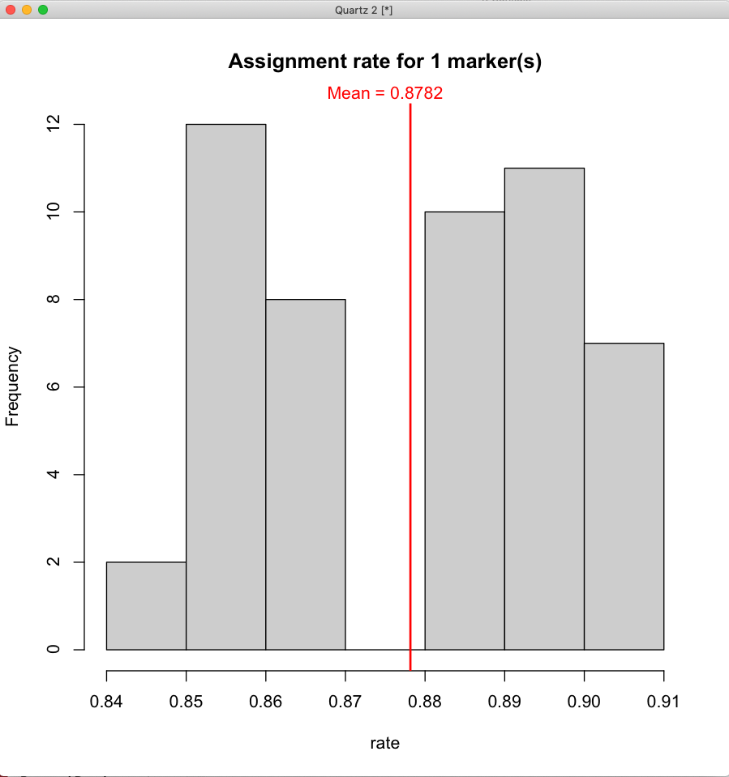

# SNP_check
This R script assesses the diagnostic power of SNP combinations from a .str formatted genotype file using leave-one-out style cross-validation. To do so, it uses [Discriminant Analysis of Principal Components](https://bmcgenomdata.biomedcentral.com/articles/10.1186/1471-2156-11-94) within [adegenet](https://github.com/thibautjombart/adegenet) as well as [pegas](https://github.com/emmanuelparadis/pegas). 

Upon running the script, the user will first be prompted with the following:

```
Enter path to working directory: 
Enter path to STRUCTURE file: 
```
Then, the user will be prompted (by adegenet) for information about the SNP genotype file:
```
 How many genotypes are there? 
 How many markers are there? 
 Which column contains labels for genotypes ('0' if absent)? 
 Which column contains the population factor ('0' if absent)? 
 Which other optional columns should be read (press 'return' when done)? 
 Which row contains the marker names ('0' if absent)? 
 Are genotypes coded by a single row (y/n)? 
```

Finally, after a few messages (again from adegenet) about the data, the user will be prompted for the following:
```
Minimum number of markers in combination:
Maximum number of markers in combination: 
Enter assignment rate threshold (minimum rate of successful assignments): 
```

With those inputs, it will randomize combinations of SNPs between the specified minimum and maximum numbers and use a priori population delimitations (via the .str file) to assess whether those SNP combinations lead to successful reassignment of a test portion of the data (generally 25 % of individuals in the dataset). During the analysis, results will be updated as more iterations are run, and figures such as the following are generated and updated:



And upon completion, summary plots like the following are generated:


Additionally upon completion, output csv files are generated with marker assignment rates and summarized results. 
